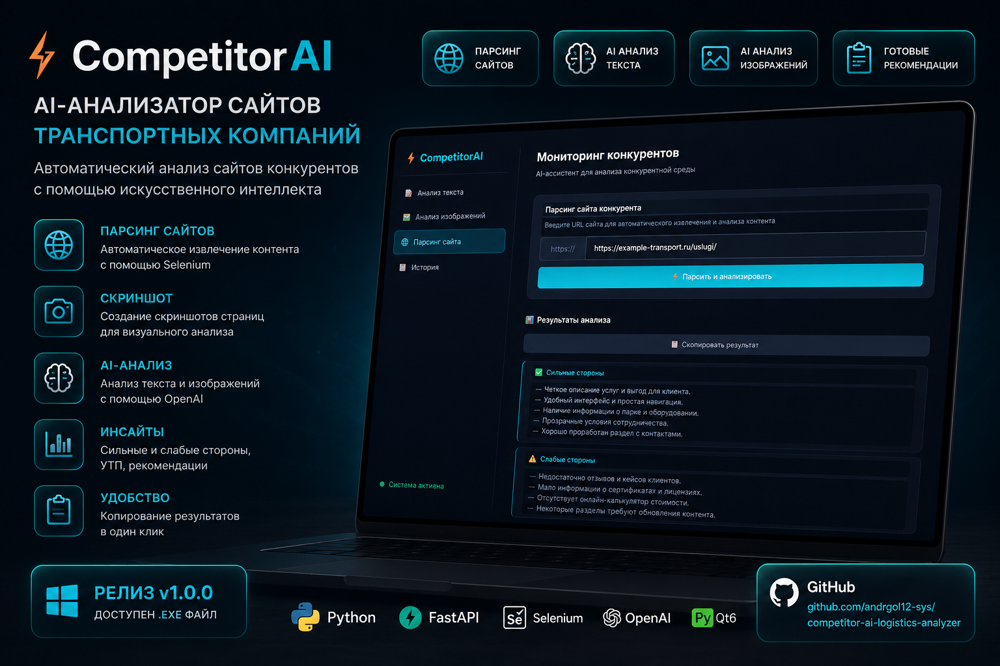
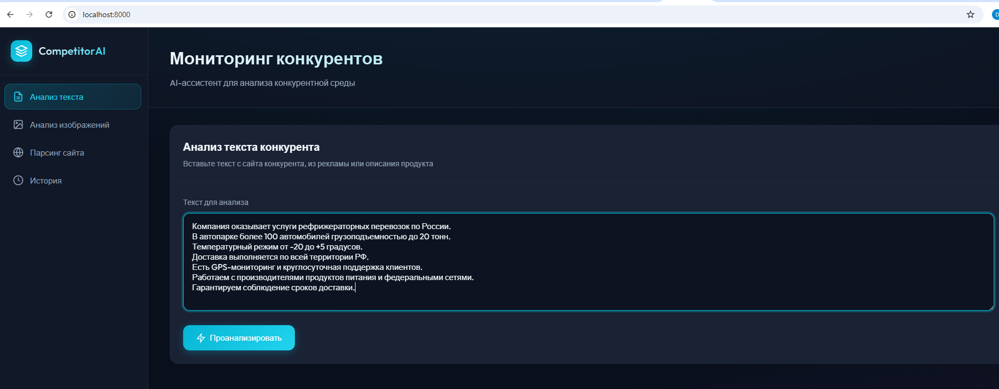
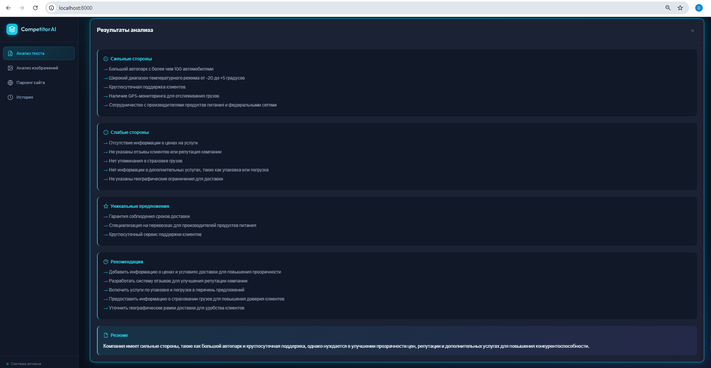
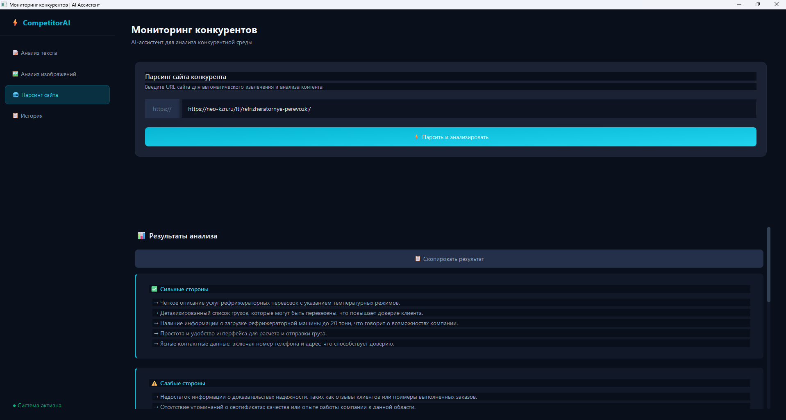

# ⚡ CompetitorAI — AI-анализатор сайтов конкурентов



**CompetitorAI** — приложение для автоматизированного анализа сайтов конкурентов с помощью искусственного интеллекта.

Система помогает быстро изучить сайт другой компании, выделить сильные и слабые стороны её предложения, определить УТП и получить рекомендации по улучшению собственного сайта или продукта.

Проект реализован на примере транспортных компаний, но подход может быть адаптирован под другие направления бизнеса.

---

## 🎯 Что умеет CompetitorAI

- 🌐 Автоматически получает информацию с сайта конкурента
- 📸 Создаёт скриншот страницы для визуального анализа
- 📝 Анализирует отдельные тексты и описания
- 🧠 Использует AI для анализа текста и изображений
- ✅ Определяет сильные стороны предложения
- ⚠️ Выявляет слабые стороны
- ⭐ Выделяет уникальные предложения
- 💡 Формирует рекомендации по улучшению
- 📋 Позволяет копировать результаты анализа
- 🕘 Сохраняет историю выполненных анализов

---

## 🖥️ Демонстрация работы

### 📝 Анализ текста

Пользователь может вставить текст с сайта конкурента, рекламного объявления или описания услуги и отправить его на AI-анализ.



Система возвращает структурированный результат: сильные и слабые стороны, уникальные предложения, рекомендации и итоговое резюме.



### 🌐 Анализ сайта

Достаточно указать адрес сайта конкурента. Система получает содержимое страницы, создаёт скриншот и передаёт данные на дальнейший AI-анализ.



---

## ⚙️ Как работает система

```text
Сайт / текст / изображение
        ↓
Получение исходных данных
        ↓
Парсинг страницы и подготовка контента
        ↓
Текст + скриншот страницы
        ↓
AI-анализ
        ↓
Структурирование результата
        ↓
Сильные стороны
Слабые стороны
УТП
Рекомендации
        ↓
Готовый результат пользователю
```

---

## 🛠️ Технологии

- **Python** — основная логика приложения
- **FastAPI** — backend
- **Selenium** — получение и обработка веб-страниц
- **OpenAI API** — AI-анализ контента
- **Vision** — анализ изображений
- **PyQt6** — desktop-интерфейс
- **PyInstaller** — сборка desktop-приложения

---

## 📁 Структура проекта

```text
competitor-ai-logistics-analyzer/
│
├── backend/          # Backend и AI-логика
├── frontend/         # Web-интерфейс
├── desktop/          # Desktop-приложение
├── assets/           # Скриншоты и материалы README
│
├── run.py            # Запуск приложения
├── requirements.txt  # Python-зависимости
├── env.example.txt   # Пример конфигурации
├── docs.md            # Дополнительная документация
└── README.md
```

---

## ▶️ Запуск

Создать виртуальное окружение:

```bash
python -m venv .venv
```

Активировать окружение в Windows:

```bash
.venv\Scripts\activate
```

Установить зависимости:

```bash
pip install -r requirements.txt
```

Настроить переменные окружения на основе:

```text
env.example.txt
```

Запустить приложение:

```bash
python run.py
```

---

## 📦 Desktop-версия

Для проекта подготовлена desktop-версия приложения под Windows.

Готовая сборка опубликована в разделе **Releases**:

**CompetitorAI v1.0.0**

Это позволяет запускать приложение как обычную Windows-программу без необходимости работать непосредственно с исходным кодом.

---

## 💼 Где можно применять

Подобное решение может использоваться для:

- конкурентного анализа;
- исследования сайтов компаний на рынке;
- анализа рекламных материалов и описаний услуг;
- сравнения позиционирования компаний;
- поиска сильных и слабых сторон предложения;
- подготовки идей для улучшения собственного сайта;
- автоматизации регулярного анализа конкурентов.

---

## 🚀 Возможности развития

Проект можно расширить:

- сравнением нескольких конкурентов одновременно;
- автоматическим формированием сравнительного отчёта;
- сохранением результатов в базу данных;
- экспортом результатов в PDF или Excel;
- регулярным повторным анализом выбранных сайтов;
- отслеживанием изменений на сайтах конкурентов.

---

## 👨‍💻 О проекте

CompetitorAI демонстрирует создание прикладного AI-инструмента, объединяющего работу с веб-страницами, текстом и изображениями в одном приложении.

Основная идея решения — превратить неструктурированную информацию с сайтов конкурентов в понятный и структурированный результат, который можно использовать для дальнейшего бизнес-анализа.
